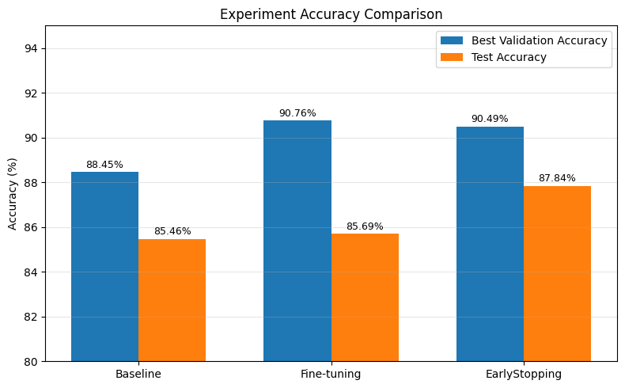

# Oxford-IIIT Pet Transfer Learning Baseline with ResNet18

This repository contains my first computer vision transfer learning pipeline using a pretrained ResNet18 model on the Oxford-IIIT Pet dataset.

## Project Goal

The goal of this project is to understand the full workflow of an image classification pipeline:

- Loading an image dataset
- Applying image transforms and augmentation
- Creating PyTorch DataLoaders
- Modifying a pretrained ResNet18 classifier
- Training and validating the model
- Saving the best checkpoint
- Evaluating on the test set
- Reviewing wrong predictions
- Running single-image inference

## Dataset

- Oxford-IIIT Pet Dataset
- Task: Pet breed classification
- Library: `torchvision.datasets.OxfordIIITPet`

The dataset is automatically downloaded by torchvision when the notebook is executed.

## Experiments

| ID | Notebook | Strategy | Description |
|---:|---|---|---|
| 00 | 00_pet_transfer_project_baseline_before_execution.ipynb | Clean baseline | Notebook without execution outputs |
| 01 | 01_pet_transfer_resnet18_baseline.ipynb | Baseline | Frozen backbone transfer learning |
| 02 | 03_pet_transfer_project_without_Freeze_version.ipynb | Fine-tuning | Unfrozen backbone with reduced LR |
| 03 | 05_pet_transfer_project_EarlyStopping.ipynb | Early Stopping | Transfer learning with early stopping |


## Experiment Summary

| Item | Description |
|---|---|
| Model | ResNet18 |
| Dataset | Oxford-IIIT Pet |
| Framework | PyTorch |
| Task | Image Classification |
| Main Goal | Practice transfer learning pipeline |

## Results

[1. baseline]
| Metric | Score |
|---|---:|
| Best Validation Accuracy | 88.45% |
| Test Accuracy | 85.46% |

[2. without_FREEZE_version]
| Metric | Score |
|---|---:|
| Best Validation Accuracy | 90.76% |
| Test Accuracy | 85.69% |

[3. EarlyStopping_version]
| Metric | Score |
|---|---:|
| Best Validation Accuracy | 90.49% |
| Test Accuracy | 87.84% |

## Accuracy Comparison(2026.05.14.ver.)



## What I Learned

- How to use a pretrained CNN model for transfer learning
- How to modify the final classifier layer
- How to separate train, validation, and test datasets
- Why `model.train()` and `model.eval()` are important
- How to evaluate wrong predictions
- How to perform single-image inference

## Repository Structure(2026.05.14.ver.)

```text
pet-transfer-resnet18/
├─ README.md
├─ requirements.txt
├─ .gitignore
├─ notebooks/
│  ┣ 00_pet_transfer_project_baseline_before_execution.ipynb
│  ┣ 01_pet_transfer_resnet18_baseline.ipynb
│  ┣ 02_pet_transfer_project_without_Freeze_version_before_execution.ipynb
│  ┣ 03_pet_transfer_project_without_Freeze_version.ipynb
│  ┣ 04_pet_transfer_project_EarlyStopping_before_execution.ipynb
│  └─05_pet_transfer_project_EarlyStopping.ipynb
├─ docs/
│  └─ assets/experiment_accuracy_comparison_05.14.png
├─ outputs/
└─ data/
```

## How to Run

1. Clone this repository.

```bash
git clone https://github.com/WSW930/pet-transfer-resnet18.git
cd pet-transfer-resnet18
```

2. Install dependencies.

```bash
pip install -r requirements.txt
```

3. Open the Notebook

```bash
jupyter notebook notebooks/01_pet_transfer_resnet18_baseline.ipynb
Or run it in Google Colab.
```

## Next Experiments
- Fine-tune the entire ResNet18 model instead of freezing the backbone(First Try - 2026.05.12.)
- Add early stopping(Frist Try - 2026.05.14.)
- Try stronger data augmentation
- Compare ResNet18 with other pretrained models
- Analyze confusion patterns between similar pet breeds
